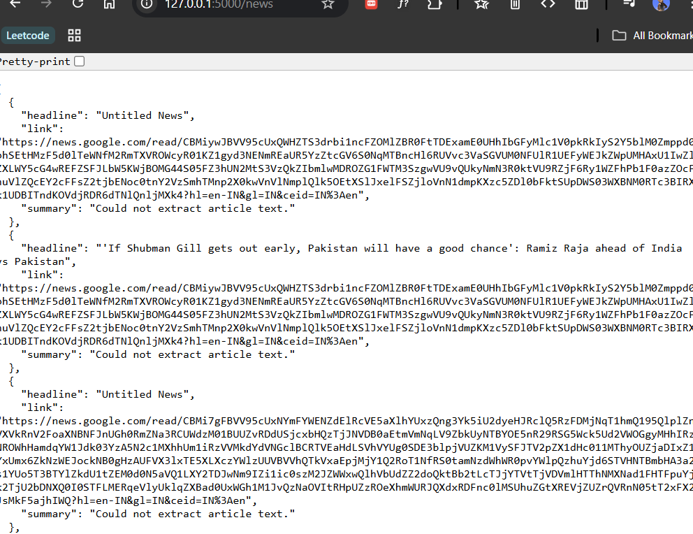
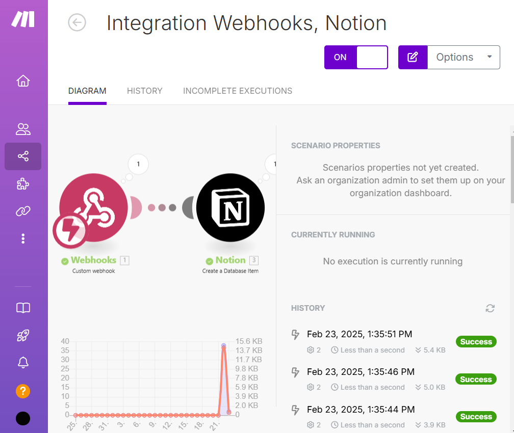
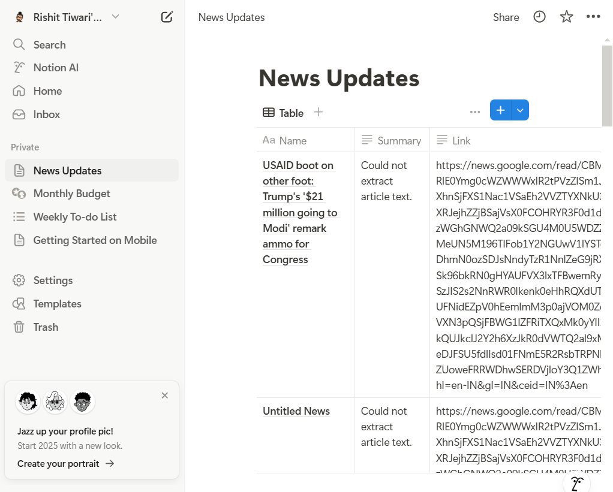

# Inshorts  

## Overview  
**Inshorts** is a platform that provides concise and easy-to-read summaries of news articles, allowing users to stay informed without reading lengthy content. It presents key highlights in a structured and visually appealing manner.  

## Features  
- **Summarized News**: Get the latest news in a short and crisp format.  
- **User-Friendly Interface**: Simple and intuitive design for easy navigation.  
- **Categories & Filters**: Browse news by category and personalize your feed.  
- **Responsive Design**: Works seamlessly across devices.

## How It Works  

### 1. Make.com Webhook  
- The application leverages **Make.com** webhooks to receive and process data dynamically.  
- Whenever new data (such as news articles) is added or updated, a **webhook trigger** is activated.  
- This allows real-time updates and automation of workflows.  

### 2. Notion Database  
- All summarized news articles are stored in a **Notion database**.  
- The database is structured to store key details like the title, summary, source, and timestamp.  
- Python interacts with this database to fetch, update, and manage data efficiently.  

### 3. Python Script  
- A Python script processes raw news articles, extracts key highlights, and formats them concisely.  
- The script then updates the **Notion database** via Notion's API.  
- It ensures that news summaries are well-structured and optimized for quick reading.

## Screenshots  
  
  
  

## Installation  
1. Clone the repository:  
   ```sh  
   git clone https://github.com/yourusername/inshorts.git  
   ``` 
2. Navigate to the project directory:  
   ```sh  
   cd inshorts  
   ```  
3. Install dependencies:  
   ```sh  
   npm install  
   ```  
4. Start the application:  
   ```sh  
   npm start  
   ```  

## Contributing  
Feel free to fork this repository and submit pull requests with improvements.  

## License  
This project is licensed under the MIT License.
